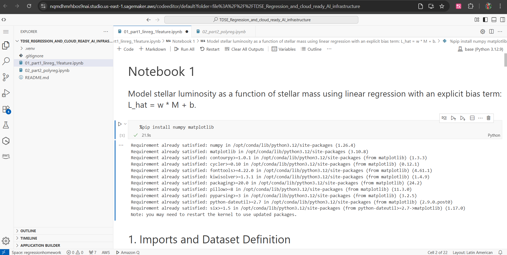
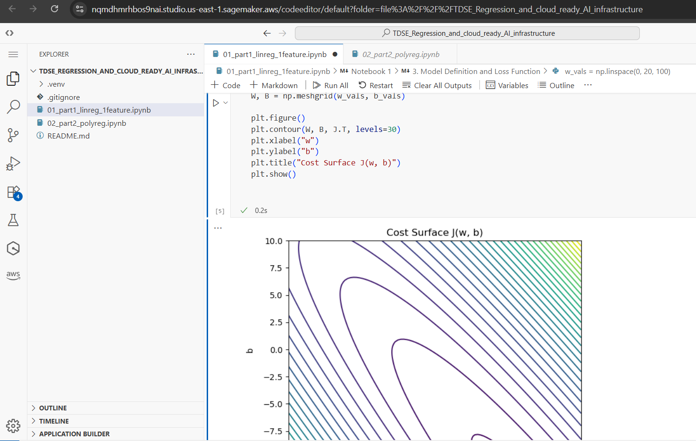
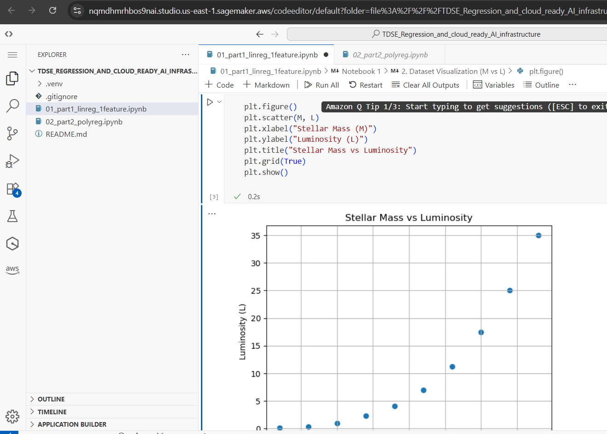
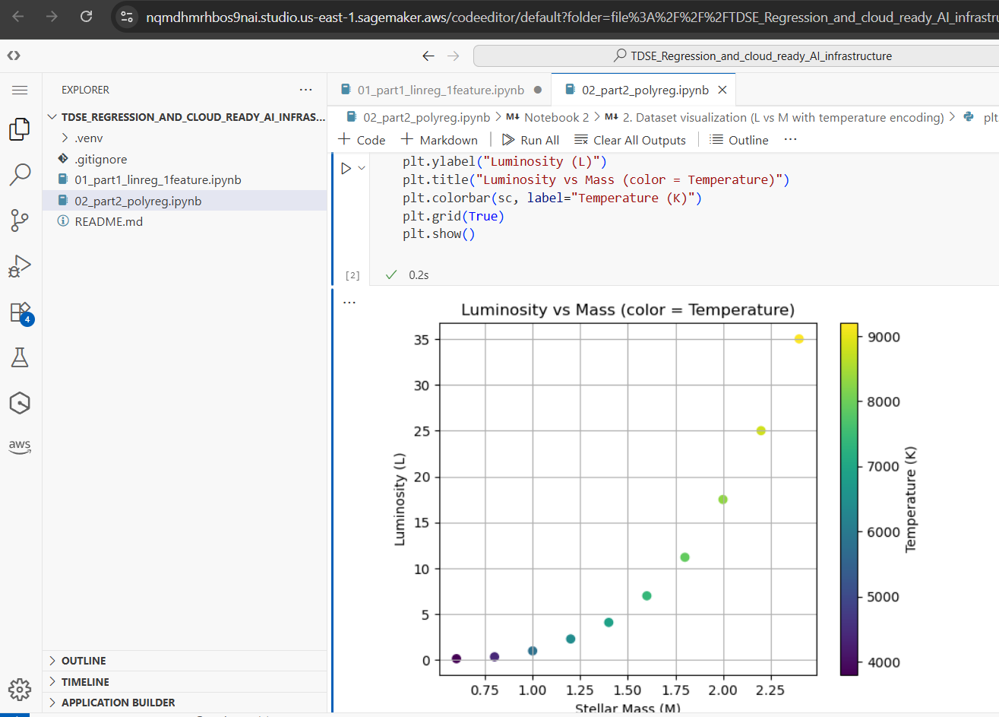

# Regression and Cloud-Ready AI Infrastructure  
## Stellar Luminosity Modeling with Linear and Polynomial Regression

**Course:** TDSE – Transformación Digital y Soluciones Empresariales 

**Student:** Santiago Amaya Zapata

**Topic:** Linear and Polynomial Models for Regression  

---

## 1. Introduction and Motivation

Astronomy is a data-driven science where relationships between physical quantities are inferred from observations. In this assignment, stellar luminosity is modeled as a function of stellar mass and temperature using **linear and polynomial regression**, implemented entirely **from first principles**.

Instead of relying on machine learning libraries, the hypothesis function, loss function, and optimization algorithm are explicitly defined. The problem is inspired by main-sequence stellar behavior, where luminosity increases rapidly with mass and exhibits nonlinear and interaction effects.

---

## 2. Enterprise and Cloud Context

This work is part of the TDSE course, where machine learning is treated as a **core architectural capability** of modern enterprise systems. Intelligence is considered a first-class quality attribute, embedded in decision-support systems and cloud platforms.

Understanding how models are built, executed, and validated in cloud environments is essential from an enterprise architecture perspective.

---

## 3. Rules and Constraints

- Single GitHub repository
- Two Jupyter notebooks and one `README.md`
- All datasets hard-coded as NumPy arrays
- Allowed libraries: Python, NumPy, Matplotlib
- No machine learning frameworks or high-level libraries used

---

## 4. Repository Structure

/
├── README.md

├── 01_part1_linreg_1feature.ipynb

└── 02_part2_polyreg.ipynb

---

## 5. Dataset and Notation

- **M:** Stellar mass (solar masses)
- **T:** Stellar temperature (Kelvin)
- **L:** Stellar luminosity (solar luminosities)

### Part I
M = [0.6, 0.8, 1.0, ..., 2.4]
L = [0.15, 0.35, 1.00, ..., 35.0]

### Part II
M = [0.6, 0.8, 1.0, ..., 2.4]
T = [3800, 4400, 5800, ..., 9200]
L = [0.15, 0.35, 1.00, ..., 35.0]

---

## 6. Notebook 1: Linear Regression (One Feature)

**File:** `01_part1_linreg_1feature.ipynb`

- Linear model: \( \hat{L} = wM + b \)
- Dataset visualization and linearity analysis
- MSE loss and cost surface visualization
- Gradient descent (loop-based and vectorized)
- Convergence analysis and learning rate experiments
- Final fit and discussion of model limitations

---

## 7. Notebook 2: Polynomial and Interaction Regression

**File:** `02_part2_polyreg.ipynb`

- Model: \( \hat{L} = Xw + b \)
- Feature map: \([M, T, M^2, M \cdot T]\)
- Vectorized loss and gradient computation
- Gradient descent and convergence plots
- Feature selection comparison (M1, M2, M3)
- Interaction term analysis
- Inference on an unseen star

---

## 8. AWS SageMaker Execution Evidence

Both notebooks were uploaded and executed successfully in **AWS SageMaker**. 

The first step was to start the lab. Then, on the AWS main screen, we went to Amazon SageMaker. Once there, we selected the domain we had created and started it. We opened it, and Visual Studio appeared. Next, we had to paste the folder containing the workshop files, select a kernel, and run the code.

### Evidence Included
- Notebooks visible in SageMaker
- Successful cell execution
- Rendered plots

For the first Notebook:

For the second Notebook:

### Local vs Cloud Execution

Notebook behavior in SageMaker was consistent with local execution, confirming cloud portability.
